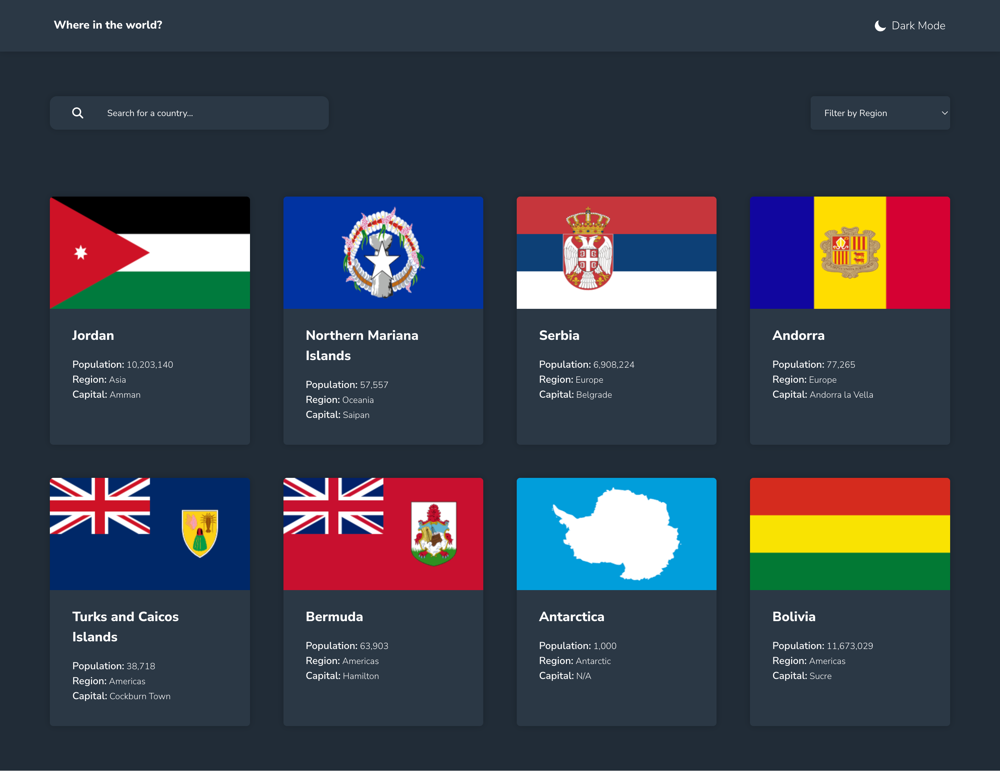

# Frontend Mentor - REST Countries API with color theme switcher solution

This is a solution to the [REST Countries API with color theme switcher challenge on Frontend Mentor](https://www.frontendmentor.io/challenges/rest-countries-api-with-color-theme-switcher-5cacc469fec04111f7b848ca). Frontend Mentor challenges help you improve your coding skills by building realistic projects.

## Table of contents

-   [Overview](#overview)
    -   [The challenge](#the-challenge)
    -   [Screenshot](#screenshot)
    -   [Links](#links)
-   [My process](#my-process)
    -   [Built with](#built-with)
    -   [What I learned](#what-i-learned)
    -   [Continued development](#continued-development)
    -   [Useful resources](#useful-resources)
-   [Author](#author)

## Overview

### The challenge

Users should be able to:

-   See all countries from the API on the homepage
-   Search for a country using an `input` field
-   Filter countries by region
-   Click on a country to see more detailed information on a separate page
-   Click through to the border countries on the detail page
-   Toggle the color scheme between light and dark mode _(optional)_

### Screenshot



### Links

-   Solution URL: [Github repo](https://github.com/Robertron624/rest-countries-details)
-   Live Site URL: [Add live site URL here](https://your-live-site-url.com)

## My process

### Built with

-   Semantic HTML5 markup
-   CSS custom properties
-   Flexbox
-   CSS Grid
-   Mobile-first workflow
-   [React](https://reactjs.org/) - JS library
-   [Sass](https://sass-lang.com/) - For styles
-   [Vite](https://vitejs.dev/) - For bundling
-   [React Router](https://reactrouter.com/) - For routing

### What I learned

This project helped me to train routing in React with react-router for handling the country's details page and a custom react hook for searching a country by name, I also used of the axios library to get data from the REST Countries API. Finally I also trained the use of Sass to create the two themes of the application.

The Css code I used to create the two themes of the application is the following:
```css
body[data-theme="dark"] {
  background-color: hsl(207, 26%, 17%);
  --container-background: hsl(209, 23%, 22%); 
  --main-text: hsl(0, 0%, 100%);
  --glass-color: hsla(0, 0%, 100%);
}

body[data-theme="light"] {
  background-color: hsl(0, 0%, 98%);
  --container-background: hsl(0, 0%, 100%);
  --main-text: hsl(200, 15%, 8%);
  --glass-color: hsl(0, 0%, 52%);
}
```

The custom hook I used to simplify the search for a country by name is the following:

```ts
const useSearch = (searchTerm: string) => {
    const [countries, setCountries] = useState<Country[]>([]);

    const [isLoading, setIsLoading] = useState<boolean>(false);

    const [error, setError] = useState<string>("");

    useEffect(() => {
        let BASE_URL:string;

        // If the search term is 3 characters long, search by country code
        if(searchTerm.length === 3) {
            BASE_URL = `https://restcountries.com/v3.1/alpha/${searchTerm}`;
        } else {
            BASE_URL = `https://restcountries.com/v3.1/name/${searchTerm}`;
        }
        // Get all countries from the API
        const searchCountry = async () => {
            setIsLoading(true);
            try {
                const response = await axios.get<Country[]>(BASE_URL);

                // limit the number of countries to 8
                const countries = response.data.slice(0, 8);
                setCountries(countries);
            } catch (error) {
                // eslint-disable-next-line @typescript-eslint/no-unsafe-argument, @typescript-eslint/no-unsafe-member-access
                setError(error.message);
            } finally {
                setIsLoading(false);
            }
        };

        void searchCountry();
    }, [searchTerm]);

    return { countries, isLoading, error };
};

export default useSearch;
```

### Continued development

I want to continue learning about React Router or another framework (like next.js) to create a multi-page application. I also want to learn how to use state management libraries like Redux or MobX to manage the state of the application if the app's state becomes too complex.
### Useful resources

-   [How to Add and Use Google and Custom Fonts in React App](https://www.positronx.io/react-js-include-custom-fonts-google-fonts-tutorial/) - This helped me to add custom fonts to my React project without needing a CDN, thus improving performance. I'd recommend it to anyone still learning this concept.

-   [Pure CSS loaders](https://loading.io/css/) - This helped me to add a loading spinner when fetching data from the API. I'd recommend it to anyone still learning this concept.

-[A Complete Guide to Routing in React](https://hygraph.com/blog/routing-in-react) - This helped me to understand how to use React Router to create a multi-page application. It's pretty easy to follow.

## Author

-   Personal Website - [Robert Ramirez](https://robert-ramirez.netlify.app)
-   Frontend Mentor User- [@Robertron624](https://www.frontendmentor.io/profile/Robertron624)
-   Twitter - [@robertdowny](https://www.twitter.com/robertdowny)
